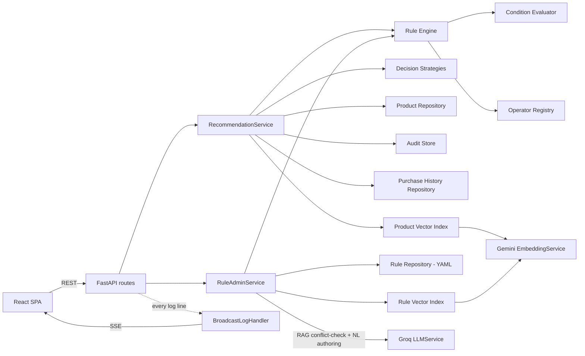

# Configurable Decision Automation Platform — E-Commerce Recommendation Engine

A backend service that evaluates **configurable business rules** (no code changes required)
against incoming requests and returns **explainable decisions** — every response says exactly
which rules ran, which matched, which were rejected (and why), and the final outcome.

The engine is domain-agnostic; this repo showcases it as an **e-commerce product recommendation
system**, with:

- A **shopper UI** — home (three rails: rule-based recommendations, purchase-history similarity,
  and all products), search → recommended rail, buy → post-purchase recommendations — each with a
  "why this?" explanation.
- An **admin UI** — create rules from plain English (via Groq) with a live match-count preview
  *before* saving, a condition builder, priority reordering, and an AI ruleset-quality review.

Interest is **not** a field a shopper fills in — no real e-commerce platform asks that. It's derived
server-side from what the shopper has actually bought (`purchase_tags`, from `app/history/`), which
also unlocks a genuinely different, embeddings-based recommendation mechanism (the purchase-history
rail) alongside the deterministic rule engine.

## Architecture

```
Browser (React SPA)
      │
      ▼
FastAPI backend
 ├─ api/routes/*        REST endpoints (rules, recommend, evaluate, catalog, logs, health)
 ├─ services/*          orchestration: recommendation_service, rule_admin_service, audit_store
 ├─ engine/*            domain-agnostic rule engine (operators, condition tree, strategies)
 ├─ rules/repository.py rules persisted as YAML (read + write)
 ├─ catalog/repository.py seeded product catalog (JSON)
 ├─ history/repository.py per-shopper purchase history (JSON) — the source of purchase_tags
 ├─ embeddings/*         Gemini embeddings + two FAISS indexes: a persisted Product Vector
 │                       Index (purchase-history rail) and an in-memory Rule Vector Index
 │                       (RAG retrieval for the rule-authoring conflict-check)
 ├─ core/logging.py      ring buffer + SSE broadcast — powers /admin/logs, no new logging
 │                       calls anywhere else needed
 └─ llm/*               Groq integration + deterministic offline fallbacks
```



Note what's *not* on this diagram on purpose: `RecommendationService` has no edge to `LLMService` — the recommendation engine never calls an LLM. An earlier design considered an AI cold-start fallback for shoppers with no history; it was replaced by the deterministic `rule-catch-all-trending` rule instead, so the rail stays 100% rule-based end to end (see Explainability below). The `Decision.used_ai_fallback` field is still in the schema but is currently always `false`.

**Why it's built this way:**
- **Operator registry** (`engine/operators.py`) — adding a new comparison type is one function +
  one line of registration. Nothing else changes. This is the platform's primary extensibility seam.
- **Condition tree** (`engine/condition_evaluator.py`) — recursive `all` / `any` / `not` / leaf
  structure, so "multiple conditional expressions" are just data, not special-cased code.
- **RuleRepository is an interface** (`rules/repository.py`) — today it's file-backed (YAML/JSON);
  a database-backed implementation could swap in without touching the engine or API.
- **Decision strategies are pluggable** (`engine/decision_strategies.py`) — default is
  weighted-score aggregation across matched rules; adding a new ranking strategy is one function.
- **AuditStore is an interface** (`services/audit_store.py`) — every decision is recorded; a
  DB-backed store could replace the in-memory one with no caller changes.
- **LLMService is an interface** (`llm/service.py`) — Groq is called through one seam, and every
  feature has a deterministic fallback (`llm/fallback.py`) so the app fully works with no API key.
- **PurchaseHistoryRepository is an interface** (`history/repository.py`) — today it's JSON-backed;
  same swap-for-a-database story as rules/audit.
- **EmbeddingService is an interface** (`embeddings/service.py`) — Gemini is called through one
  seam, with a deterministic hashing-trick fallback vector when no key is configured or a call
  fails, so the purchase-history rail works fully offline, same discipline as `LLMService`.
- **The Recommendation rail stays 100% rule-based, on purpose.** The purchase-history rail
  (embeddings + FAISS) is a genuinely different, additive mechanism — not a replacement — because
  the rule engine's `rules_evaluated`/`rules_matched`/`rules_rejected` trace is what makes decisions
  explainable, and an LLM's self-reported reason for a choice is not guaranteed to be the actual
  cause of that choice. Each mechanism is used where it's the right tool, not routed through an LLM
  by default.

## Rule schema

```yaml
- id: rule-gaming-laptop
  name: High-budget gamer -> gaming laptop
  priority: 100          # higher = evaluated first / weighted more
  enabled: true
  version: 1              # bumped automatically on every edit
  condition:
    all:
      - field: purchase_tags
        operator: any_in
        value: [gaming]
      - any:
          - field: max_budget
            operator: gte
            value: 1000
          - field: budget_band
            operator: equals_ci
            value: high
  recommend:
    products: [p001, p035]   # explicit product ids
    tags: [gaming]            # OR resolve by tag
    categories: []            # OR resolve by category
    score: 5                  # contribution weight
```

Available operators: `eq, ne, gt, gte, lt, lte, between, is_true, is_false, contains, equals_ci,
starts_with, regex, in, not_in, any_in, all_in, exists, date_before, date_after` — see
`app/engine/operators.py` to add more.

## Explainability

Every `/recommend/*` and `/evaluate` response is a `Decision` with:
- `rules_evaluated` — how many enabled rules ran
- `rules_matched` / `rules_rejected` — each with the specific reason (e.g.
  `"age=15 did not match 'gte' 18"`)
- `recommendations` — ranked products, each listing which rule(s) contributed and their score
- `explanation` — one human-readable sentence summarizing the decision
- `used_ai_fallback` — true when no rule matched and Groq's cold-start suggestions were used instead

The purchase-history rail (`POST /recommend/similar`) is deliberately **not** a `Decision` — it has
no rule trace, only a similarity score, so it gets its own `SimilarProductsResponse` shape instead
of diluting the rule engine's explainability format with a different mechanism.

## Extensibility & the "twist-proofing" built in

| If asked to... | Where it plugs in |
|---|---|
| Add a new rule type | one function in `engine/operators.py` |
| Add new decision logic | one function in `engine/decision_strategies.py` |
| Add rule versioning | `Rule.version` / `updated_at` already tracked on every edit |
| Add audit history | `GET /decisions`, `GET /decisions/{id}` already implemented |
| Add bulk evaluation | `POST /recommend/bulk` already implemented |
| Add auth | add a dependency to `api/routes/rules.py` (admin) — routes are otherwise unauthenticated by design |
| Swap rule storage to a DB | implement `RuleRepository` (rules/repository.py) against a table |
| Swap purchase history to a DB | implement `PurchaseHistoryRepository` (history/repository.py) against a table |
| Integrate an external API | already done — the Groq integration in `llm/service.py`, and the Gemini embeddings integration in `embeddings/service.py` |

## AI features

All optional — the app runs fully offline with deterministic fallbacks if no API key is set.

**Groq** — admin-tooling assistant, one seam (`llm/service.py`):
1. **NL → rule authoring**: `POST /rules/from-text` — admin describes a rule in English, Groq
   returns the structured rule; the admin UI immediately shows a live match-count preview
   (`POST /rules/preview-draft`) in the same modal, before the rule is ever saved.
2. **Cold-start fallback**: when zero rules match a shopper, `RecommendationService` asks Groq to
   suggest catalog products; these are labeled "AI suggestion" in the UI and `used_ai_fallback: true`
   in the API — clearly distinguished from rule-driven picks.
3. **Post-save feedback loop**: after saving a rule, the admin UI calls `POST /rules/{id}/preview`;
   if the rule's recommend targets resolve to zero catalog products, Groq suggests a concrete
   product to add (or the admin can adjust the rule).
4. **Ruleset quality review**: `POST /rules/review` — Groq scans all rules for conflicts,
   redundancy, and coverage gaps.

**Gemini embeddings** — the purchase-history rail, one seam (`embeddings/service.py`):
5. **`POST /recommend/similar`**: embeds the catalog once (cached) and the shopper's purchase
   history, then ranks by cosine similarity via a FAISS index (`embeddings/index.py`) — a genuinely
   different recommendation mechanism from the rule engine, not a wrapper around it. Falls back to
   a deterministic hashing-trick vector with zero network calls when `GEMINI_API_KEY` is unset or
   the API call fails, so the rail never hard-depends on a live network connection.

## Setup

### Backend
```bash
cd backend
python3 -m venv .venv && source .venv/bin/activate
pip install -r requirements.txt
cp .env.example .env   # optionally set GROQ_API_KEY and/or GEMINI_API_KEY
uvicorn app.main:app --reload --port 8000
```
Swagger UI: http://localhost:8000/docs

### Frontend
```bash
cd frontend
npm install
cp .env.example .env
npm run dev -- --port 5173
```
Open http://localhost:5173 (shopper) and http://localhost:5173/admin (admin).

### Docker Compose (both services)
```bash
cp backend/.env.example backend/.env   # optionally set GROQ_API_KEY and/or GEMINI_API_KEY
docker compose up --build
```
Backend on `:8000`, frontend on `:3000`. The backend service loads `backend/.env` directly
(`env_file` in `docker-compose.yml`) — set `GROQ_API_KEY` and/or `GEMINI_API_KEY` there to enable
live Groq/Gemini calls. `backend/.env` is optional (the compose file treats it as
`required: false`), so `docker compose up` still works with zero setup — every AI feature just runs
on its deterministic fallback instead.

### Tests
```bash
cd backend && pytest -v
```
55 tests covering operators, the condition tree, rule engine ordering/explanation, decision
strategies, file-repository read/write round-trips (incl. reorder/versioning), purchase-history
repository round-trips, the embeddings fallback vector and FAISS index, the recommendation service
(home/search/purchase/cold-start/bulk/purchase-history similarity), and end-to-end API behavior.

## Example requests

```bash
# Home recommendations — purchase_tags derived server-side from shopper_id's purchase history
curl -X POST http://localhost:8000/recommend/home \
  -H "Content-Type: application/json" \
  -d '{"profile": {"budget_band": "high", "max_budget": 2000}, "shopper_id": "shopper-demo-gamer"}'

# Search-driven recommendations
curl -X POST http://localhost:8000/recommend/search \
  -H "Content-Type: application/json" \
  -d '{"profile": {}, "shopper_id": "shopper-demo-gamer", "search_query": "laptop"}'

# Post-purchase recommendations — also persists the purchase to history
curl -X POST http://localhost:8000/recommend/purchase \
  -H "Content-Type: application/json" \
  -d '{"profile": {}, "shopper_id": "shopper-demo-gamer", "purchased_product_id": "p009"}'

# Purchase-history similarity rail (embeddings + FAISS, not rule-based)
curl -X POST http://localhost:8000/recommend/similar \
  -H "Content-Type: application/json" \
  -d '{"shopper_id": "shopper-demo-gamer"}'

# Bulk evaluation
curl -X POST http://localhost:8000/recommend/bulk \
  -H "Content-Type: application/json" \
  -d '{"profiles": [{"budget_band": "high"}, {"budget_band": "low"}]}'

# Create a rule from plain English
curl -X POST http://localhost:8000/rules/from-text \
  -H "Content-Type: application/json" \
  -d '{"text": "Recommend gaming accessories to users interested in gaming who search for a laptop, priority high"}'

# Preview an unsaved draft rule before committing it
curl -X POST http://localhost:8000/rules/preview-draft \
  -H "Content-Type: application/json" \
  -d '{"name": "Draft", "priority": 10, "condition": {"field": "purchase_tags", "operator": "any_in", "value": ["gaming"]}, "recommend": {"tags": ["gaming"], "score": 1.0}}'

# Retrieve a past decision (audit trail)
curl http://localhost:8000/decisions
```

See [docs/API.md](docs/API.md) for the full endpoint reference and
[AI_ENGINEERING_LOG.md](AI_ENGINEERING_LOG.md) for how AI tools were used to build this.

