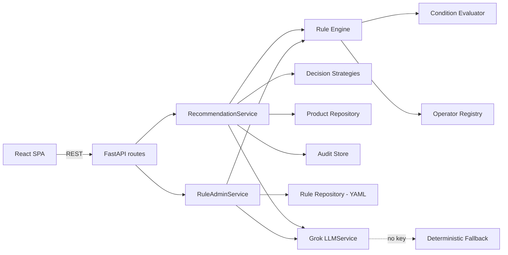

# Configurable Decision Automation Platform — E-Commerce Recommendation Engine

A backend service that evaluates **configurable business rules** (no code changes required)
against incoming requests and returns **explainable decisions** — every response says exactly
which rules ran, which matched, which were rejected (and why), and the final outcome.

The engine is domain-agnostic; this repo showcases it as an **e-commerce product recommendation
system**, with:

- A **shopper UI** — profile → home recommendations, search → recommended rail, buy → post-purchase
  recommendations — each with a "why this?" explanation.
- An **admin UI** — create rules from plain English (via Grok), a condition builder, priority
  reordering, a live per-rule recommendation preview, and an AI ruleset-quality review.

## Architecture

```
Browser (React SPA)
      │
      ▼
FastAPI backend
 ├─ api/routes/*        REST endpoints (rules, recommend, evaluate, catalog, health)
 ├─ services/*          orchestration: recommendation_service, rule_admin_service, audit_store
 ├─ engine/*            domain-agnostic rule engine (operators, condition tree, strategies)
 ├─ rules/repository.py rules persisted as YAML (read + write)
 ├─ catalog/repository.py seeded product catalog (JSON)
 └─ llm/*               Grok (xAI) integration + deterministic offline fallbacks
```



**Why it's built this way:**
- **Operator registry** (`engine/operators.py`) — adding a new comparison type is one function +
  one line of registration. Nothing else changes. This is the platform's primary extensibility seam.
- **Condition tree** (`engine/condition_evaluator.py`) — recursive `all` / `any` / `not` / leaf
  structure, so "multiple conditional expressions" are just data, not special-cased code.
- **RuleRepository is an interface** (`rules/repository.py`) — today it's file-backed (YAML/JSON);
  a database-backed implementation could swap in without touching the engine or API.
- **Decision strategies are pluggable** (`engine/decision_strategies.py`) — default is
  weighted-score aggregation across matched rules; adding a new ranking strategy is one function.
- **AuditStore is an interface** (`services/audit_store.py`) — every decision is recorded; a
  DB-backed store could replace the in-memory one with no caller changes.
- **LLMService is an interface** (`llm/service.py`) — Grok is called through one seam, and every
  feature has a deterministic fallback (`llm/fallback.py`) so the app fully works with no API key.

## Rule schema

```yaml
- id: rule-gaming-laptop
  name: High-budget gamer -> gaming laptop
  priority: 100          # higher = evaluated first / weighted more
  enabled: true
  version: 1              # bumped automatically on every edit
  condition:
    all:
      - field: interests
        operator: any_in
        value: [gaming]
      - any:
          - field: max_budget
            operator: gte
            value: 1000
          - field: budget_band
            operator: equals_ci
            value: high
  recommend:
    products: [p001, p035]   # explicit product ids
    tags: [gaming]            # OR resolve by tag
    categories: []            # OR resolve by category
    score: 5                  # contribution weight
```

Available operators: `eq, ne, gt, gte, lt, lte, between, is_true, is_false, contains, equals_ci,
starts_with, regex, in, not_in, any_in, all_in, exists, date_before, date_after` — see
`app/engine/operators.py` to add more.

## Explainability

Every `/recommend/*` and `/evaluate` response is a `Decision` with:
- `rules_evaluated` — how many enabled rules ran
- `rules_matched` / `rules_rejected` — each with the specific reason (e.g.
  `"age=15 did not match 'gte' 18"`)
- `recommendations` — ranked products, each listing which rule(s) contributed and their score
- `explanation` — one human-readable sentence summarizing the decision
- `used_ai_fallback` — true when no rule matched and Grok's cold-start suggestions were used instead

## Extensibility & the "twist-proofing" built in

| If asked to... | Where it plugs in |
|---|---|
| Add a new rule type | one function in `engine/operators.py` |
| Add new decision logic | one function in `engine/decision_strategies.py` |
| Add rule versioning | `Rule.version` / `updated_at` already tracked on every edit |
| Add audit history | `GET /decisions`, `GET /decisions/{id}` already implemented |
| Add bulk evaluation | `POST /recommend/bulk` already implemented |
| Add auth | add a dependency to `api/routes/rules.py` (admin) — routes are otherwise unauthenticated by design |
| Swap rule storage to a DB | implement `RuleRepository` (rules/repository.py) against a table |
| Integrate an external API | already done — the Grok/xAI integration in `llm/service.py` |

## AI (Grok) features

All optional — the app runs fully offline with deterministic fallbacks if `XAI_API_KEY` is unset.

1. **NL → rule authoring**: `POST /rules/from-text` — admin describes a rule in English, Grok
   returns the structured rule, pre-filling the admin form for review before saving.
2. **Cold-start fallback**: when zero rules match a shopper, `RecommendationService` asks Grok to
   suggest catalog products; these are labeled "AI suggestion" in the UI and `used_ai_fallback: true`
   in the API — clearly distinguished from rule-driven picks.
3. **Post-save feedback loop**: after saving a rule, the admin UI calls `POST /rules/{id}/preview`;
   if the rule's recommend targets resolve to zero catalog products, Grok suggests a concrete
   product to add (or the admin can adjust the rule).
4. **Ruleset quality review**: `POST /rules/review` — Grok scans all rules for conflicts,
   redundancy, and coverage gaps.

## Setup

### Backend
```bash
cd backend
python3 -m venv .venv && source .venv/bin/activate
pip install -r requirements.txt
cp .env.example .env   # optionally set XAI_API_KEY
uvicorn app.main:app --reload --port 8000
```
Swagger UI: http://localhost:8000/docs

### Frontend
```bash
cd frontend
npm install
cp .env.example .env
npm run dev -- --port 5173
```
Open http://localhost:5173 (shopper) and http://localhost:5173/admin (admin).

### Docker Compose (both services)
```bash
docker compose up --build
```
Backend on `:8000`, frontend on `:3000`. Set `XAI_API_KEY` in your shell env before `up` to enable
live Grok calls; otherwise all AI features run on deterministic fallbacks.

### Tests
```bash
cd backend && pytest -v
```
41 tests covering operators, the condition tree, rule engine ordering/explanation, decision
strategies, file-repository read/write round-trips (incl. reorder/versioning), the recommendation
service (home/search/purchase/cold-start/bulk), and end-to-end API behavior.

## Example requests

```bash
# Home recommendations for a gamer
curl -X POST http://localhost:8000/recommend/home \
  -H "Content-Type: application/json" \
  -d '{"profile": {"interests": ["gaming"], "budget_band": "high", "max_budget": 2000}}'

# Search-driven recommendations
curl -X POST http://localhost:8000/recommend/search \
  -H "Content-Type: application/json" \
  -d '{"profile": {"interests": []}, "search_query": "laptop"}'

# Post-purchase recommendations
curl -X POST http://localhost:8000/recommend/purchase \
  -H "Content-Type: application/json" \
  -d '{"profile": {"interests": []}, "purchased_product_id": "p009"}'

# Bulk evaluation
curl -X POST http://localhost:8000/recommend/bulk \
  -H "Content-Type: application/json" \
  -d '{"profiles": [{"interests": ["gaming"]}, {"interests": ["beauty"]}]}'

# Create a rule from plain English
curl -X POST http://localhost:8000/rules/from-text \
  -H "Content-Type: application/json" \
  -d '{"text": "Recommend gaming accessories to users interested in gaming who search for a laptop, priority high"}'

# Retrieve a past decision (audit trail)
curl http://localhost:8000/decisions
```

See [docs/API.md](docs/API.md) for the full endpoint reference and
[AI_ENGINEERING_LOG.md](AI_ENGINEERING_LOG.md) for how AI tools were used to build this.
